# Расширение для браузера Chrome "KAI - Arlecchino Mode"

  
Это расширение изменяет визуальный стиль сайта <a href="https://kai.ru/">kai.ru</a> и <a href="https://abiturientu.kai.ru/">abiturientu.kai.ru</a> на кастомную тему, вдохновленную персонажем Арлекино из игры Genshin Impact.

  
  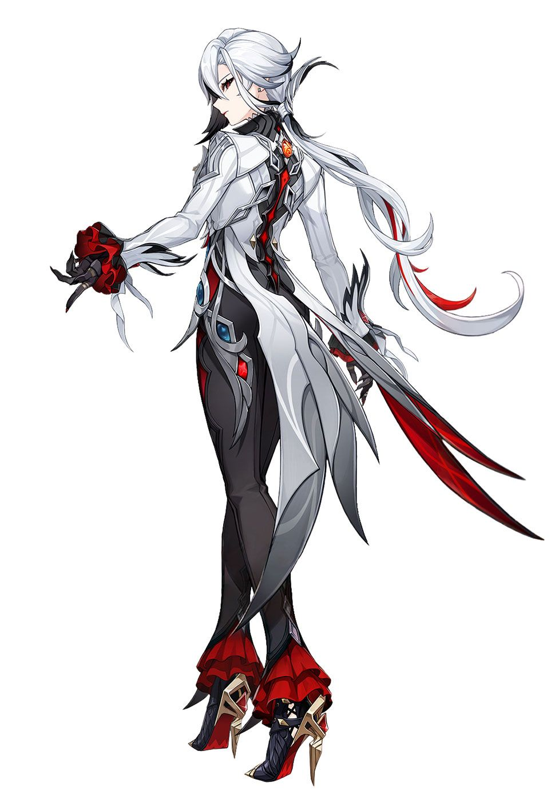
  
  
Расширение добавляет на страницу специальную кнопку, которая позволяет в любой момент включать и отключать кастомный стиль. Состояние темы сохраняется, так что вам не придется включать её каждый раз при входе на сайт.

## Инструкция по запуску:
Так как расширение не опубликовано в официальных магазинах, его необходимо установить в режиме разработчика. Процесс идентичен для обоих браузеров (Google Chrome и Yandex browser).

1.  Скачайте или клонируйте репозиторий с проектом на ваш компьютер.
2.  Откройте браузер и перейдите на страницу управления расширениями: chrome://extensions (для Yandex Browser - browser://extensions).
3.  Включите "Режим разработчика" в правом верхнем углу.
4.  Нажмите на кнопку "Загрузить распакованное расширение".
5.  Выберите папку с файлами вашего проекта (style-plugin).

После этого расширение будет установлено и готово к работе.

## Так выглядит само расширение во вкладке расширений:

  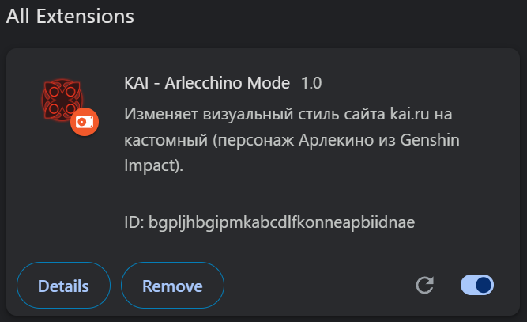

После установки перейдите на сайт [kai.ru](https://kai.ru/) или  [abiturientu.kai.ru](https://abiturientu.kai.ru/). В правом верхнем углу вы увидите кнопку для переключения темы.

## Примеры работы!
## Пример 1: самое начало
### Стандартный вид сайта:

  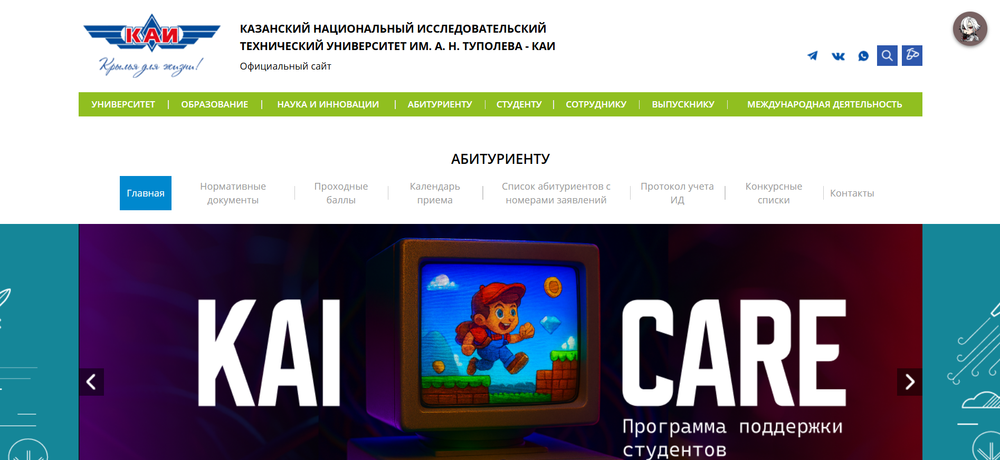

### Вид с включенным "Arlecchino Mode":

  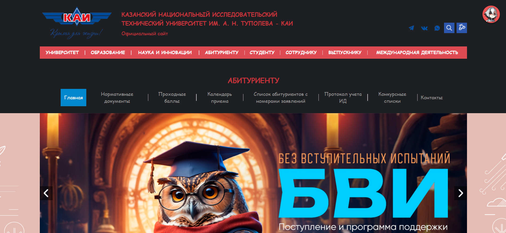

## Пример 2: новости
### Стандартный вид сайта:

  

### Вид с включенным "Arlecchino Mode":

  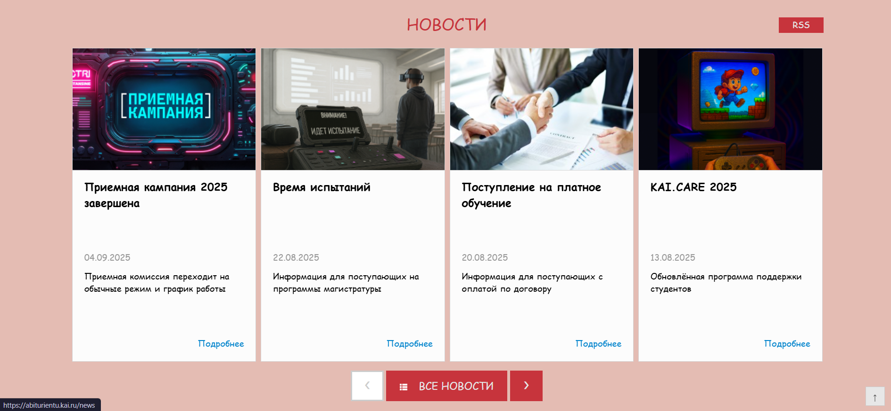

## Пример 3: институты и студенты об университете
### Стандартный вид сайта:

  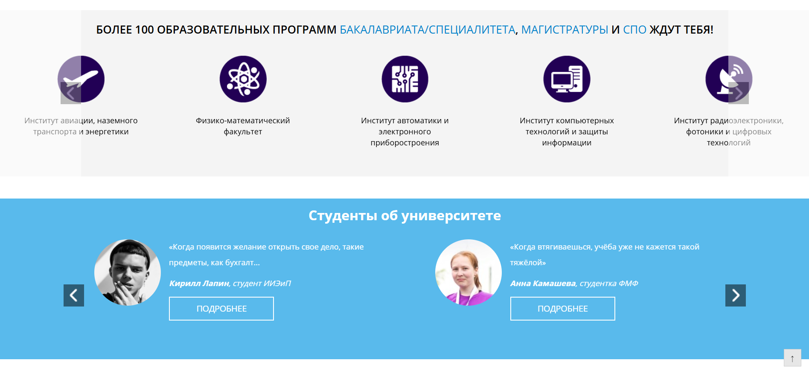

### Вид с включенным "Arlecchino Mode":

  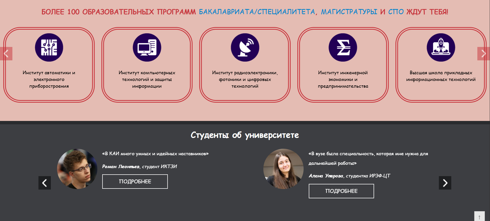

## Пример 4: футер и чуть-чуть до него
### Стандартный вид сайта:

  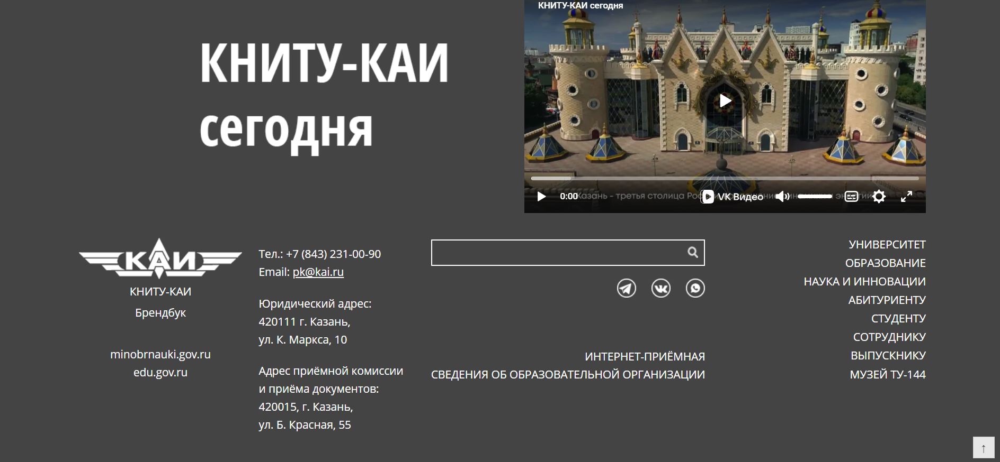

### Вид с включенным "Arlecchino Mode":

  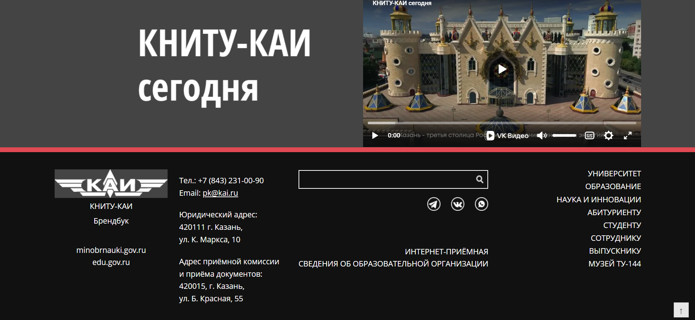

## Пример 5: список абитуриентов
### Стандартный вид сайта:

  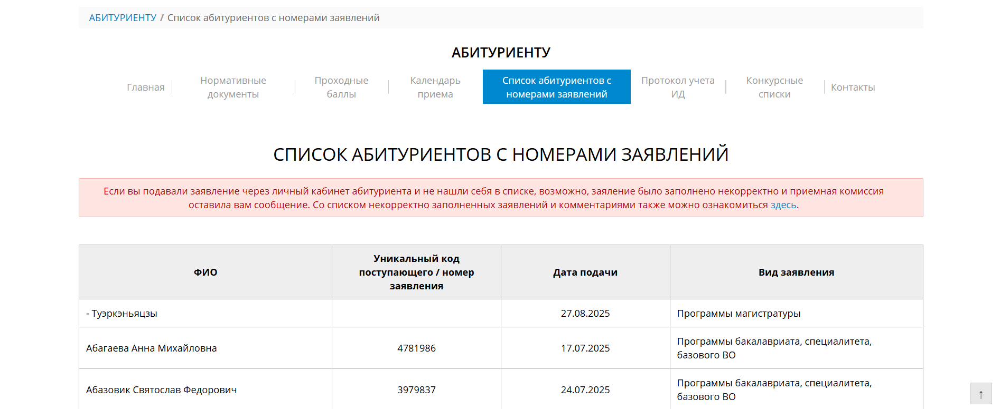

### Вид с включенным "Arlecchino Mode":

  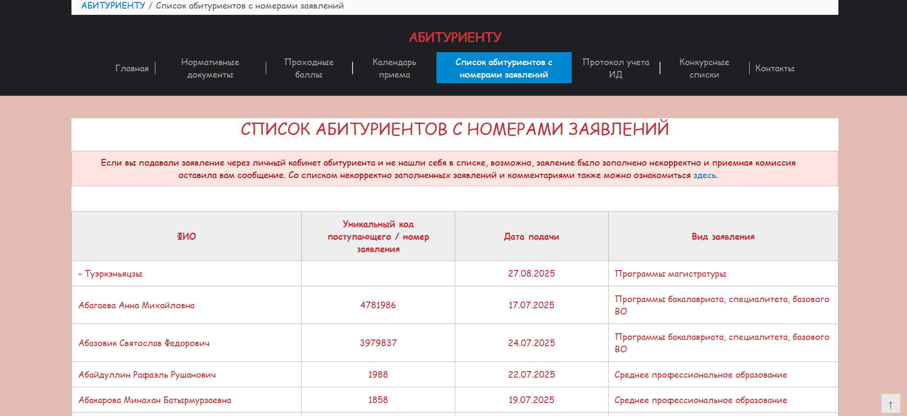

## Пример 6: жизнь студента
### Стандартный вид сайта:

  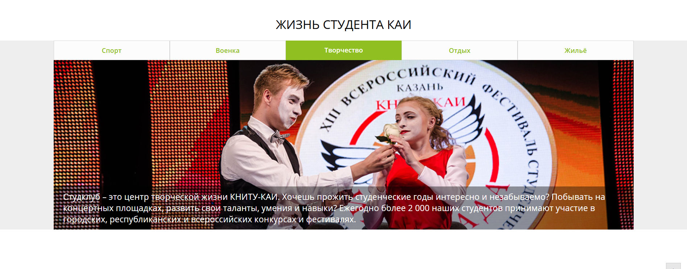

### Вид с включенным "Arlecchino Mode":

  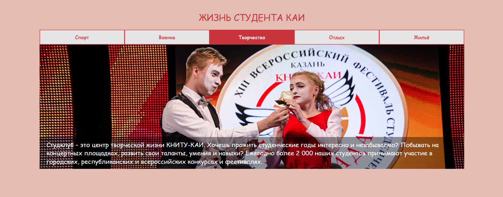

## Пример 7: календарь приёма
### Стандартный вид сайта:

  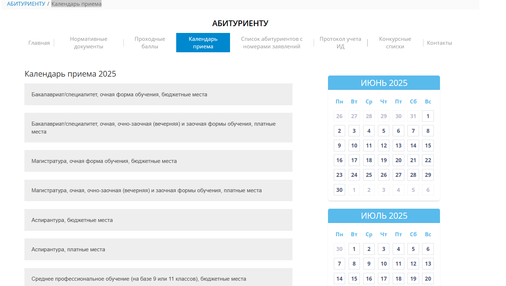

### Вид с включенным "Arlecchino Mode":

  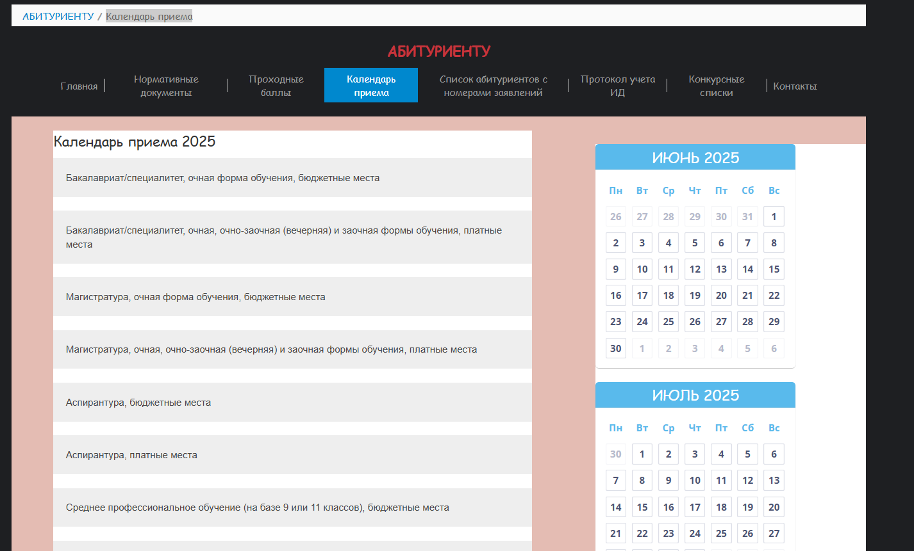

