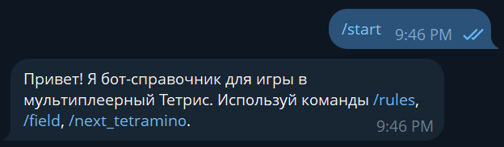
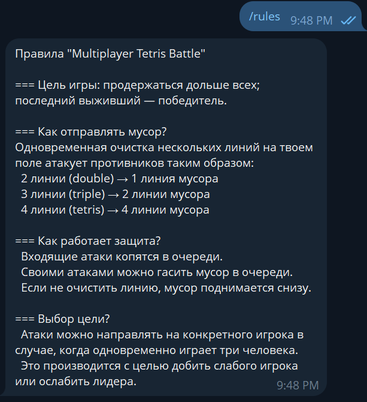
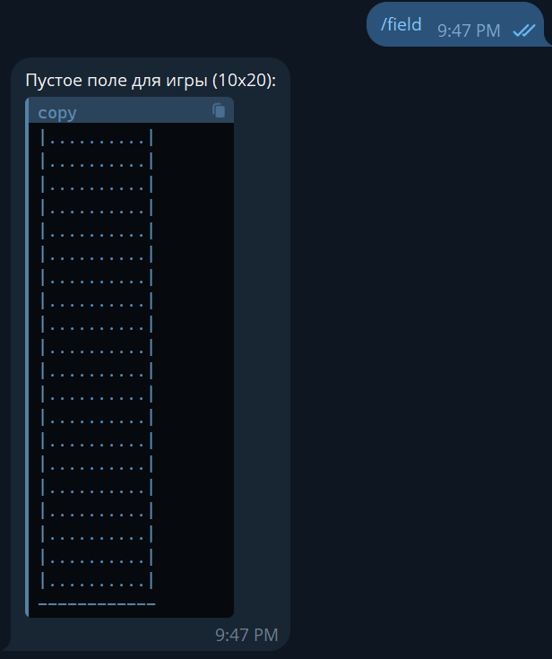
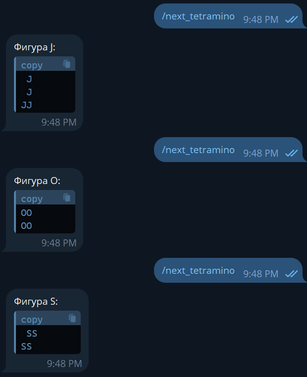

# Telegram-бот по игре "Multiplayer Tetris Battle"

#### Это телеграм-бот, который служит справочником для игры в мультиплеерный тетрис.

#### Бот помогает пользователям быстро получить основную информацию об игре: правила, внешний вид игрового поля и примеры игровых фигур.


<div align="center">

## === Функционал ===

</div>

Бот поддерживает следующие команды:

`/start` - отображает приветственное сообщение и список доступных команд
`/rules` - присылает подробные правила игры в мультиплеерный тетрис
`/field` - показывает, как выглядит пустое игровое поле (стакан) размером 10x20
`/next_tetramino` - выдает случайную фигуру тетрамино в текстовом виде

<div align="center">

## === Установка и запуск ===

</div>

Для запуска проекта на вашем локальном компьютере выполните следующие шаги:

1.  Клонируйте репозиторий (или просто скопируйте файлы проекта в нужную папку).

2.  Установите все зависимости с помощью npm:
    ```
    npm install
    ```

3.  Настройте переменные окружения. Создайте файл `.env` в корневой папке проекта, скопировав в него содержимое из `.env.example`:
    ```
    cp .env.example .env
    ```
    Затем откройте файл `.env` и вставьте ваш уникальный токен для Telegram-бота, полученный от [@BotFather](https://t.me/BotFather).
    ```
    TELEGRAM_BOT_TOKEN='ВАШ_СЕКРЕТНЫЙ_ТОКЕН'
    ```

4.  Запустите бота в рабочем режиме:
    ```
    npm start
    ```

5.  Найдите вашего бота в Telegram и начните с ним работу.

<div align="center">

## === Полезные команды ===

</div>

`npm test` — запустить все тесты
`npm run test:coverage` — запустить тесты и сгенерировать отчет о покрытии кода
`npm run lint` — проверить код на соответствие стандартам ESLint
`npm run lint:fix` — автоматически исправить ошибки, найденные ESLint

<div align="center">

## === Примеры работы приложения ===

</div>

**Команда `/start`**

При первом запуске бот приветствует пользователя.



---

**Команда `/rules`**

Демонстрация вывода правил игры.



---

**Команда `/field`**

Пример отображения пустого игрового поля.



---

**Команда `/next_tetramino`**

Пример вывода случайной фигуры тетрамино.

