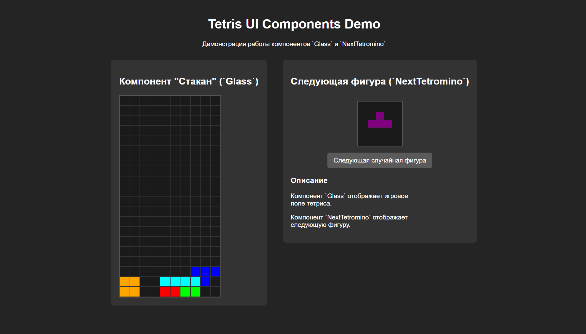

# UI-библиотека для Тетриса и демонстрационное приложение

<br>

<div align="center">
  <h2>Описание проекта</h2>
</div>

Этот репозиторий является решением пятой лабораторной работы и содержит в себе два независимых проекта:

- **`ui-library`** — библиотека UI-компонентов на React и TypeScript, она содержит всю логику, стили и тесты для компонентов и не зависит от демонстрационного приложения.

- **`frontend`** — демонстрационное веб-приложение, которое импортирует и использует компоненты из ui-library для наглядной демонстрации их функциональности и внешнего вида.

### Разработанные компоненты

*   **`Glass`**
    *   **Назначение:** Отображение игрового поля (стакана) тетриса.
    *   **Props:** Принимает двумерный массив чисел, где каждое число соответствует цвету ячейки. Компонент полностью функционален даже если пропс не передан.
    *   **Особенности:** Имеет заданную дефолтную размерность 20x10.

*   **`NextTetromino`**
    *   **Назначение:** Отображение следующей фигуры тетрамино в превью-окне.
    *   **Props:** Принимает объект, описывающий форму и цвет фигуры.
    *   **Особенности:** Отображает фигуру в превью-окне размером 5x5.


<div align="center">
  <h2>Инструкцию по запуску</h2>
</div>

### Требования
- Node.js (рекомендуется v18+)
- npm (поставляется с Node.js)

### Пошаговая установка
Процесс установки и запуска включает настройку обоих проектов.

1.  **Установка зависимостей библиотеки:**
    Откройте терминал в папке проекта (`js_6310_labs/lab5-react/solutions/student-21/multiplayer-tetris-battle`) и выполните команды:
    ```bash
    cd ui-library
    npm install
    ```

2.  **Сборка библиотеки:**
    Перед запуском основного приложения необходимо один раз собрать библиотеку:
    ```bash
    npm run build
    ```

3.  **Установка зависимостей приложения:**
    Теперь установите зависимости для демонстрационного приложения:
    ```bash
    cd ../frontend
    npm install
    ```

4.  **Запуск приложения:**
    Запустите сервер для разработки:
    ```bash
    npm run dev
    ```
    После этого откройте браузер по адресу, указанному в терминале (обычно `http://localhost:5173`).

<br>

<div align="center">
  <h2>Скрины с примерами работы приложения</h2>
</div>

### Внешний вид приложения
